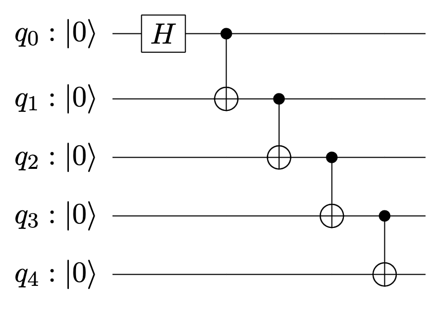

# Lab 1 Quantum Circuit Simulation
## 实验简介

本次实验中，我们使用 `qubit-simulator` 研究量子电路模拟。`qubit-simulator` 是一个简单而轻量级的Python 包，提供了一个用于模拟量子比特和量子门的量子模拟器，支持基本的量子操作，如 Hadamard 门、π/8 相位旋转门、受控非门和一般酉变换。

### 安装

在命令行中使用如下指令安装 `qubit-simulator`

```bash
pip install qubit-simulator
```

### 模拟器初始化

`QubitSimulator` 类用于初始化一个指定数量量子比特的模拟器，其中每个量子比特被初始化为 $|0\rangle$ 态：

```python
from qubit_simulator import QubitSimulator

simulator = QubitSimulator(num_qubits=3)
```

### 施加量子门

对于常用量子门，`QubitSimulator` 提供了一些简单方法在模拟器中的量子比特上施加量子门操作，例如:

```python
simulator.h(target_qubit=0)      # Hadamard gate
simulator.t(target_qubit=1)      # π/8 gate
simulator.cx(control_qubit=0, target_qubit=2)  # CNOT gate
```

### 一般量子门

除了上述常用的量子门操作，`QubitSimulator` 提供了接口函数用于施加一般的酉变换：

```python
simulator.u(target_qubit=2, theta=0.3, phi=0.4, lambda_=0.5)  # Generic gate
```

### 量子测量

模拟器可以通过 `run` 方法对所有量子比特进行重复测量，返回测量结果的统计分布：

```python
simulator.run(shots=100)
```

> {'000': 51, '101': 41, '001': 6, '100': 2}

### 电路可视化

```python
print(simulator)
```

```plaintext
-----------------------------------
| H |   | @ |                     |
|   | T |   |                     |
|   |   | X | U(0.30, 0.40, 0.50) |
-----------------------------------
```

## 实验要求

1. 根据 `qubit_simulator` 中的源代码分析 `qubit-simulator` 的基本原理、结构及运行流程。
   
2. 使用 `qubit-simulator` 构造如下图所示的五量子比特 GHZ 电路，并模拟运行，画出结果概率分布直方图。


3. 下段代码构造了一个量子电路，运行这段代码，并尝试调整代码中 `n_qubits` 的值，然后观察量子电路模拟的运行时间。绘制量子电路模拟运行时间与量子电路比特数的关系图，并分析 `qubit-simulator` 进行量子电路模拟的复杂度。

```python
import random
import time
from qubit_simulator import QubitSimulator

def apply_circuit(circuit, n):
    circuit.h(n - 1)
    for qubit in range(n - 1):
        circuit.cu(qubit, qubit + 1, random.random() * 3.14, random.random() * 3.14, random.random() * 3.14)

n_qubits = 5 # change this value (<=16)
simulator = QubitSimulator(n_qubits)

t = time.time()
apply_circuit(simulator, n_qubits)
print(time.time() - t)

simulator.run(shots=1000)
```
