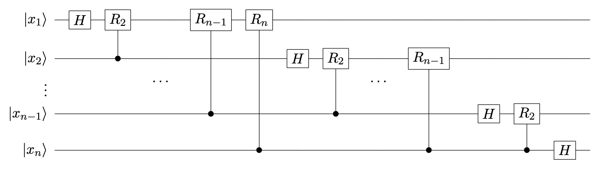
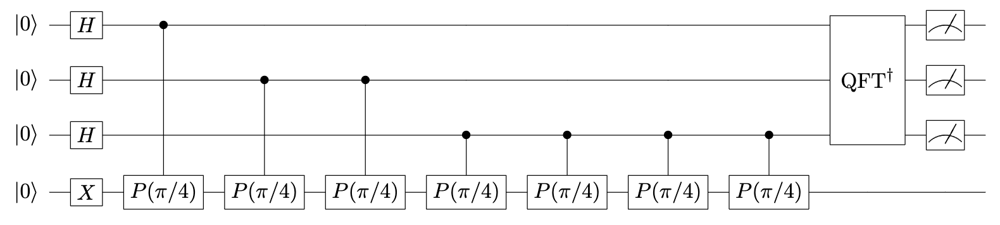
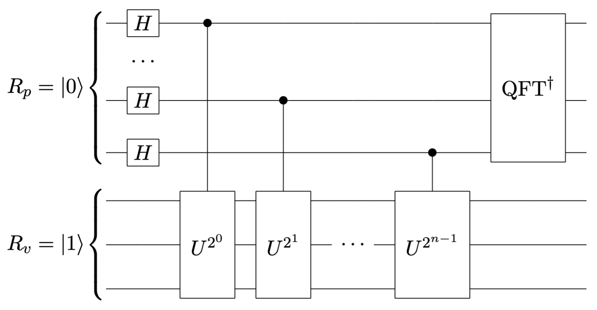

# Lab 2 Quantum Algorithm
## 实验简介

本次实验中，我们使用 `qiskit==1.0.2` 模拟运行量子电路以进一步理解 QFT，QPE 和 Shor 算法的原理。

### QFT 算法

量子傅里叶变换（Quantum Fourier Transform，QFT）是量子计算中的一种核心算法，是经典傅里叶变换的量子版本，能够将一个量子态在计算基底上的表示转换为频率基底上的表示。

对于一个 $n$ 量子比特的输入态 $|x\rangle$，QFT 定义为：

$
\text{QFT}|x\rangle = \frac{1}{\sqrt{2^n}} \sum_{k=0}^{2^n - 1} e^{\frac{2\pi i}{2^n}xk} |k\rangle
$

QFT 的电路实现可以通过一系列受控旋转门和 Hadamard 门实现，如下图所示:



### QPE 算法

量子相位估计（Quantum Phase Estimation，QPE）是量子计算中的一种重要算法，主要用于估计酉矩阵本征态对应本征值的相位，是许多量子算法（如 Shor 算法和量子模拟）的关键部分。

对于酉矩阵 $U$ 的本征态 $|\psi\rangle$ 对应本征值的相位 $\phi$，即：

$
U|\psi\rangle = e^{2\pi i\phi}|\psi\rangle
$

QPE 算法使用两部分量子寄存器实现相位估计。下图展示了使用三个量子比特作为计数寄存器和一个量子比特作为特征寄存器的 QPE 电路：



其中 $P(\theta)$ 为相位旋转门：

$
P(\theta) = \begin{bmatrix} 1 & 0 \\ 0 & e^{i\theta} \end{bmatrix}
$

因此，该电路用于估计 $P(\pi/4)$ 门的本征态 $|1\rangle$ 对应本征值的相位，即 $\phi = 1/8$。

### Shor 算法

Shor 算法是一种用于大整数分解的量子算法，通过量子相位估计算法来找到周期性，从而分解大整数。它是量子计算最具革命性的算法之一，展示了量子计算在解决经典计算难题中的优势。

Shor 算法通过将大整数分解问题转化为计算阶问题，从而实现量子加速。假设 $N$ 是待分解的大整数，$N = pq$，其中 $p$ 和 $q$ 是两个素数。任意选取整数 $a$，使得 $a$ 和 $N$ 互质，使用量子过程计算 $a$ 的阶 $r$，使得 $a^r \equiv 1 \mod N$。根据小端规则，基于 `qiskit` 的量子电路实现如下图所示：



其中

$
U|u_s\rangle = e^{\frac{2\pi is}{r}}|u_s\rangle
$

$
\frac{1}{\sqrt{r}}\sum_{s=0}^{r-1}|u_s\rangle = |1\rangle
$

## 实验要求

1. QFT 算法

```python
from numpy import pi
from qiskit import QuantumCircuit, transpile
from qiskit.providers.basic_provider import BasicSimulator

def qft(qc:QuantumCircuit) -> QuantumCircuit:
    for i in range(qc.num_qubits - 1, -1, -1):
        qc.h(i)
        for j in range(i - 1, -1, -1):
            qc.cp(pi / 2 ** (i - j), j, i)
    for i in range(qc.num_qubits // 2):
        qc.swap(i, qc.num_qubits - i - 1)
    return qc

# TODO: change the number of qubits
n_qubits = 3
qc = QuantumCircuit(n_qubits)
# TODO: add quantum gate to set the initial state
qc = qft(qc)
qc.measure_all()
print(qc)

backend = BasicSimulator()
tqc = transpile(qc, backend)
result = backend.run(tqc).result()
counts = result.get_counts()
print(counts)
```

- 以上代码实现了一个三量子比特的 QFT 算法，运行代码查看结果态采样的频率分布。
- 将 `n_qubits` 改为 2，初态设置为 $|10\rangle$，获得双量子比特的 QFT 电路，验证输出与理论结果一致。（注意：`qiskit` 中的量子比特按小端排列，即低索引的量子比特对应量子态比特串中的低位，如 $|q_1q_0\rangle$，这与课程 PPT 的表示方式相反）
- 通过观察 `qft` 函数或者理论推导，计算 QFT 算法量子门层数（在所有量子比特上并行操作的一组量子门视为一层）关于量子比特数的复杂度。

2. QPE 算法

- 根据 QFT 算法的实现代码，构建实验简介中的 QPE 电路，运行代码查看结果态采样的频率分布。
  
    其中，可以通过如下代码将一个三量子比特逆 QFT 电路拼接至四量子比特电路中：
    ```python
    from qiskit.circuit.library import QFT

    qc = QuantumCircuit(4)
    qc = qc.compose(QFT(3, inverse=True), [0, 1, 2])
    ```
    此外，量子比特的部分测量需要通过声明量子和经典比特寄存器实现，代码示例如下：
    ```python
    from qiskit import QuantumRegister, ClassicalRegister

    qr = QuantumRegister(4)
    cr = ClassicalRegister(3)
    qc = QuantumCircuit(qr, cr)
    qc.measure([0, 1, 2], [0, 1, 2])
    ```
    这里将索引为 [0, 1, 2] 的量子比特的测量结果存储至索引为 [0, 1, 2] 的经典比特上。

- 更改 $P(\theta)$ 门中的角度参数为 $2\pi/3$，验证输出与理论结果一致。
- 基于 $P(\theta)$ 门计算 QPE 算法量子门层数关于相位估计精度（即计数寄存器中的量子比特数）的复杂度。
- 更改特征寄存器的初态为非本征态 $|\varphi\rangle = [3/5, 4/5]^\top$，验证输出与理论结果一致。

3. Shor 算法

```python
import numpy as np
from qiskit import QuantumCircuit, transpile
from qiskit.circuit.library import UnitaryGate, QFT
from qiskit.providers.basic_provider import BasicSimulator

def shor_circuit(N, a, n_p, n_v):
    qc = QuantumCircuit(n_p + n_v, n_p)

    for q in range(n_p):
        qc.h(q)
    qc.x(n_p)

    for q in range(n_p):
        exponent = 2 ** q
        ctrl_mod = mod_exp_circuit(a, exponent, N, n_v).to_gate().control(1)
        qc.append(ctrl_mod, [q] + list(range(n_p, n_p + n_v)))
    
    qc.append(QFT(n_p, inverse=True), range(n_p))

    qc.measure(range(n_p), range(n_p))
    return qc

def mod_exp_circuit(a, power, N, n_v):
    qc = QuantumCircuit(n_v)
    for _ in range(power):
        qc.append(mod_circuit(a, N, n_v), range(n_v))
    return qc

def mod_circuit(a, N, n_v):
    matrix = np.zeros((2 ** n_v, 2 ** n_v), dtype=int)
    # TODO: complete modular multiplication circuit
    return UnitaryGate(matrix)

N = 15
a = 7
n_p = 3 # number of qubits in period register
n_v = 4 # number of qubits in value register
qc = shor_circuit(N, a, n_p, n_v)
print(qc.draw())

backend = BasicSimulator()
tqc = transpile(qc, backend)
result = backend.run(tqc).result()
counts = result.get_counts()
print("counts:", counts)

r = len(counts)
print(f"r: {r}")

if r % 2 == 0 and pow(a, r // 2, N) != N - 1:
    factor1 = np.gcd(pow(a, r // 2) - 1, N)
    factor2 = np.gcd(pow(a, r // 2) + 1, N)
    print(f"{N} = {factor1} * {factor2}")
else:
    print("Invalid a!")
```

- 以上代码使用 `qiskit` 部分实现了 Shor 算法，请补全 `mod_circuit` 函数中量子门 $U$ 对应的酉矩阵定义，以构造量子门
$
U|y\rangle = |ay(\text{mod}\ n)\rangle
$。
- 运行补全的代码，取 $a=7$，分解整数 $N=15$，观察输出的计数结果，验证分解结果是否正确。
- 修改代码中的部分参数，选取合适的 $a$，分解整数 $N=21$。
- （选做）记录选到合适的 $a$ 的概率，分析 $a$ 的选取如何影响算法复杂度。
