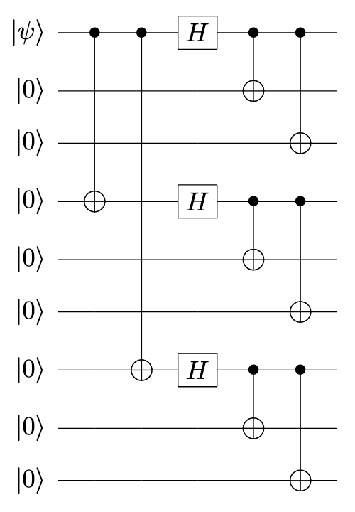
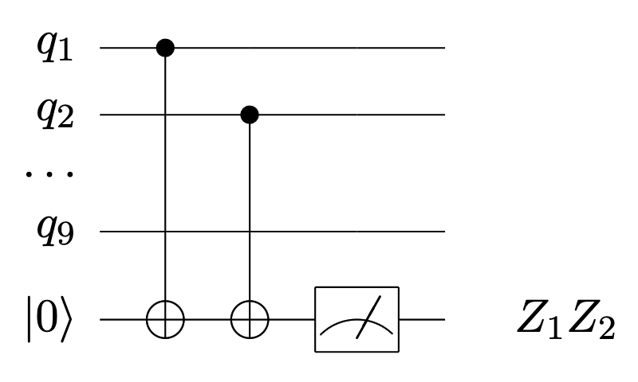
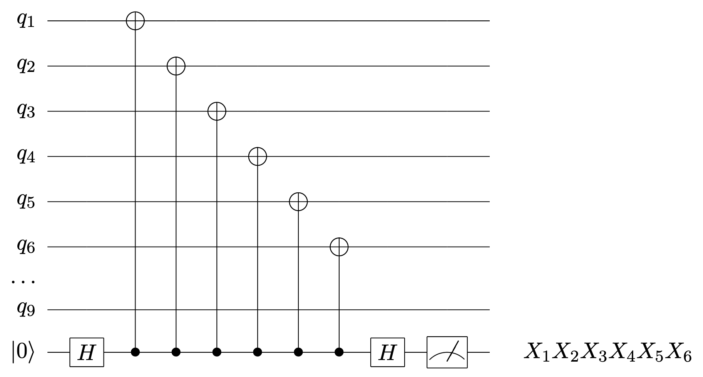
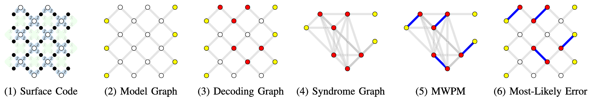

# Lab 3 Quantum Error Correction
## 实验简介

本次实验中，我们使用 `qiskit` 模拟 9 比特 Shor 编码的运行，并基于表面码实现基础的解码算法。

### Shor 编码

Shor 编码使用如下的量子电路将任意量子态编码为逻辑态。



该电路首先将量子比特做相位翻转编码：$\ket{0}\to\ket{+++}, \ket{1}\to\ket{---}$。接着，再将每一个量子比特做比特翻转编码：$\ket{+}\to\frac{1}{\sqrt{2}}(\ket{000}+\ket{111}), \ket{-}\to\frac{1}{\sqrt{2}}(\ket{000}-\ket{111})$。最终得到如下的九量子比特编码：

$$
\ket{0}\to\ket{0_L}\equiv\frac{(\ket{000}+\ket{111})(\ket{000}+\ket{111})(\ket{000}+\ket{111})}{2\sqrt{2}}
$$
$$
\ket{1}\to\ket{1_L}\equiv\frac{(\ket{000}-\ket{111})(\ket{000}-\ket{111})(\ket{000}-\ket{111})}{2\sqrt{2}}
$$

### 稳定子码

Shor 编码是一种稳定子码，能够抵抗任意单比特 Pauli-X 和 Pauli-Z 错误，其稳定子可由 8 个独立的稳定子生成元描述：
$$
S = \langle Z_1Z_2, Z_2Z_3, Z_4Z_5, Z_5Z_6, Z_7Z_8, Z_8Z_9, X_1X_2X_3X_4X_5X_6, X_4X_5X_6X_7X_8X_9 \rangle
$$
其中，$Z$ 生成子源于内层的比特翻转编码，检测 Pauli-X 错误；$X$ 生成子源于外层的相位翻转编码，检测 Pauli-Z 错误。

不难验证，$\{\ket{0_L}, \ket{1_L}\}$ 张成的向量空间即为 $S$ 作用下稳定的向量空间。

### 征状测量

若由 Shor 编码的逻辑态经过了噪声信道干扰，进行稳定子测量即可提取错误征状，以检测发生的 Pauli-X 和 Pauli-Z 错误。

对于 $Z$ 生成子，以 $Z_1Z_2$ 征状测量为例，其征状测量电路如下：



对于 $X$ 生成子，以 $X_1X_2X_3X_4X_5X_6$ 征状测量为例，其征状测量电路如下：



对稳定子的每一独立生成元实施稳定子测量，即为一轮征状测量。

### 错误纠正

根据不同的征状测量结果可以解码出不同的错误类型，并对逻辑态施加相应的错误纠正电路。

对于 Pauli-X 错误，以 $Z_1Z_2$ 和 $Z_2Z_3$ 征状测量为例，不同的征状测量结果、错误类型与错误纠正电路的对应关系如下：

| $Z_1Z_2$ | $Z_2Z_3$ | 单比特错误类型 | 错误纠正电路 |
| :------: | :------: | :------: | :--------: |
| 0 | 0 | 无错误 | 无操作 |
| 0 | 1 | $q_3$ 发生 Pauli-X 错误 | 对 $q_3$ 施加 $X$ 门 |
| 1 | 0 | $q_1$ 发生 Pauli-X 错误 | 对 $q_1$ 施加 $X$ 门 |
| 1 | 1 | $q_2$ 发生 Pauli-X 错误 | 对 $q_2$ 施加 $X$ 门 |

对于 Pauli-Z 错误，以 $X_1X_2X_3X_4X_5X_6$ 和 $X_4X_5X_6X_7X_8X_9$ 征状测量为例，不同的征状测量结果、错误类型与错误纠正电路的对应关系如下：

| $X_1X_2X_3X_4X_5X_6$ | $X_4X_5X_6X_7X_8X_9$ | 单比特错误类型 | 错误纠正电路 |
| :------: | :------: | :------: | :--------: |
| 0 | 0 | 无错误 | 无操作 |
| 0 | 1 | $q_7$、$q_8$ 或 $q_9$ 发生 Pauli-Z 错误 | 对 $q_7$ 施加 $Z$ 门 |
| 1 | 0 | $q_1$、$q_2$ 或 $q_3$ 发生 Pauli-Z 错误 | 对 $q_1$ 施加 $Z$ 门 |
| 1 | 1 | $q_4$、$q_5$ 或 $q_6$ 发生 Pauli-Z 错误 | 对 $q_4$ 施加 $Z$ 门 |

### 解码算法

对于更加复杂的纠错码，我们往往难以枚举所有的错误征状以进行错误纠正。下面将基于表面码介绍最小权重完美匹配（Minimum Weight Perfect Matching, MWPM）算法。该算法是目前最常用且有效的表面码解码算法之一。

错误发生后，稳定子测量将产生一组错误征状（syndrome），即稳定子值发生翻转的集合。解码算法的任务就是根据错误征状，推断出最有可能发生的物理错误模式，并施加相应的纠正操作来恢复逻辑量子态。



如上图所示，MWPM 解码算法通常可以分解为 6 个步骤：

1. 确定量子纠错码与噪声模型
- 该例中使用表面码并考虑比特翻转错误和相位翻转错误
2. 创建模型图（Model Graph）并对边赋予权重
- 根据表面码结构和噪声模型，创建一个模型图，其中黄色节点表示虚拟边界
- 每条边 $e$ 被赋予权重 $w_e=log(\frac{1-P(e)}{P(e)})$，$P(e)$ 为该条边上物理比特的错误概率
3. 测量错误症状并创建解码图（Decoding Graph）
- 测量得到错误症状，创建解码图
- 每个红色的稳定子节点表示一个缺陷点，缺陷点的集合就是错误症状
4. 创建症状图（Syndrome Graph）
- 传统 MWPM 算法需要将解码图转换为症状图，节点仅包含缺陷点
- 症状图是一个完全图，即任意两个缺陷点之间都有边
- 症状图上任意两个缺陷点之间边的权重等于它们在解码图中的最短路径权重，即最短的错误链
5. 在症状图上找到最小权重完美匹配（MWPM）
- 匹配是一组边，使得图中的每个顶点都恰好与其中一条边相连（完美匹配）
- 要求匹配中所有边的权重之和最小（最小权重）
6. 确定最可能的物理错误（Most-Likely Error）
- 将步骤 5 找到的最小权重完美匹配重新映射回解码图中的最小权重路径
- 对这些错误进行逆操作，即可恢复原始量子态

## 实验要求

1. Shor 编码

```python
from qiskit import QuantumCircuit
from qiskit.quantum_info import Statevector

def shor_encoding(qc: QuantumCircuit):
    # TODO: complete the circuit for 9-qubit Shor code encoding
    pass

qc = QuantumCircuit(9)
# TODO: set the physical state as |1>
shor_encoding(qc)
print(qc)

state = Statevector.from_instruction(qc)
print(state)
```

- 根据 9 量子比特 Shor 纠错码的编码电路，将 `shor_encoding` 函数补充完整。
- 运行代码，使用 `Statevector` 仿真电路运行后的系统态矢量，验证编码结果的正确性。
- 将被编码的量子态 $\ket{\psi}$ 置为 $\ket{1}$，验证编码结果的正确性。

2. 征状测量

```python
import random
from qiskit import QuantumRegister, ClassicalRegister, transpile
from qiskit.providers.basic_provider import BasicSimulator

def random_error(qc: QuantumCircuit):
    qubit_id = random.randint(0, 9)
    noise_gate = random.choice(["X", "Z"])
    if noise_gate == "X":
        qc.x(qubit_id)
    elif noise_gate == "Z":
        qc.z(qubit_id)
    print(f"Random Pauli-{noise_gate} error on qubit {qubit_id}.")

def syndrome_measurement(qc: QuantumCircuit):
    # reset ancilla qubits
    for i in range(8):
        qc.reset(9+i)
    
    # measure stablizer Z_1Z_2
    qc.cx(0, 9)
    qc.cx(1, 9)
    qc.measure(9, qc.cregs[0][0]) # hint: qc.cregs = [sz0, sz1, sz2, sx]

    # TODO: complete the circuit for syndrome measurement

qr = QuantumRegister(9+8) # first 9 data qubits for logical state, rest 8 ancilla qubits for syndrome measurement
sz0 = ClassicalRegister(2, "sz0") # register for syndrome Z_1Z_2 and Z_2Z_3
sz1 = ClassicalRegister(2, "sz1") # register for syndrome Z_4Z_5 and Z_5Z_6
sz2 = ClassicalRegister(2, "sz2") # register for syndrome Z_7Z_8 and Z_8Z_9
sx = ClassicalRegister(2, "sx") # register for syndrome X_1X_2X_3X_4X_5X_6 and X_4X_5X_6X_7X_8X_9
qc = QuantumCircuit(qr, sz0, sz1, sz2, sx)
shor_encoding(qc)
# TODO: apply random Pauli-X or Pauli-Z error to the logical state
syndrome_measurement(qc)
print(qc)

backend = BasicSimulator()
tqc = transpile(qc, backend)
result = backend.run(tqc).result()
counts = result.get_counts()
print(counts)
```

- 根据征状测量的示例电路，将 `syndrome_measurement` 函数补充完整，实现 Shor 纠错码完整的一轮征状测量。（提示：现有代码已实现对生成子 $Z_1Z_2$ 的征状测量，注意将征状测量结果存入对应的经典比特寄存器。）
- 运行代码，观察无噪声时的征状测量结果。
- 在征状测量电路前随机插入 $X$ 或 $Z$ 门，模拟噪声对逻辑量子态的影响，解释征状测量结果的变化。

3. 错误纠正

```python
def error_correction(qc: QuantumCircuit):
    # error correction based on syndrome Z_1Z_2 and Z_2Z_3
    qc.x(0).c_if(qc.cregs[0], 1)
    qc.x(2).c_if(qc.cregs[0], 2)
    qc.x(1).c_if(qc.cregs[0], 3)

    # TODO: complete the circuit of error correction

qr = QuantumRegister(9+8) # first 9 data qubits for logical state, rest 8 ancilla qubits for syndrome measurement
sz0 = ClassicalRegister(2, "sz0") # register for syndrome Z_1Z_2 and Z_2Z_3
sz1 = ClassicalRegister(2, "sz1") # register for syndrome Z_4Z_5 and Z_5Z_6
sz2 = ClassicalRegister(2, "sz2") # register for syndrome Z_7Z_8 and Z_8Z_9
sx = ClassicalRegister(2, "sx") # register for syndrome X_1X_2X_3X_4X_5X_6 and X_4X_5X_6X_7X_8X_9
qc = QuantumCircuit(qr, sz0, sz1, sz2, sx)
shor_encoding(qc)
# TODO: test all possible single qubit error
random_error(qc)
syndrome_measurement(qc)
error_correction(qc)
syndrome_measurement(qc)

backend = BasicSimulator()
tqc = transpile(qc, backend)
result = backend.run(tqc).result()
counts = result.get_counts()
print(counts)
```

- 根据征状测量结果与错误纠正电路的对应关系，将 `error_correction` 函数补充完整。（提示：生成子 $Z_1Z_2$ 和 $Z_2Z_3$ 的征状测量结果被存储在经典比特寄存器 `sz0`（即 `qc.cregs[0]`）中，现有代码已根据其取值实现相应的错误纠正电路。）
- 运行代码，测试所有可能发生的单比特错误，验证再次进行征状测量的结果与无噪声的征状测量结果相符，即逻辑态被恢复。

4. 解码算法

[`surface_code_mwpm_decoding.py`](./surface_code_mwpm_decoding.py) 中提供了使用 `stim`、`networkx` 部分实现的 MWPM 算法，请完成如下任务：

- 根据注释内容，补全 `ManualMWPMDecoder` 类下的 `decode` 函数，计算最可能发生的物理错误。
- 运行代码，测试 MWPM 算法在不同码距和不同物理错误率条件下的解码效果。

## 思考题（选做）

- 若经 Shor 编码的逻辑态中的多个比特发生了错误，还能进行有效的错误纠正吗？
- Shor 编码对 Pauli-Z 和 Pauli-X 错误的纠正能力相同吗？
- 将你实现的 MWPM 算法与基于 `pymatching` 实现的 MWPM 算法进行对比，两者在解码复杂度、解码精度方面有何不同？
